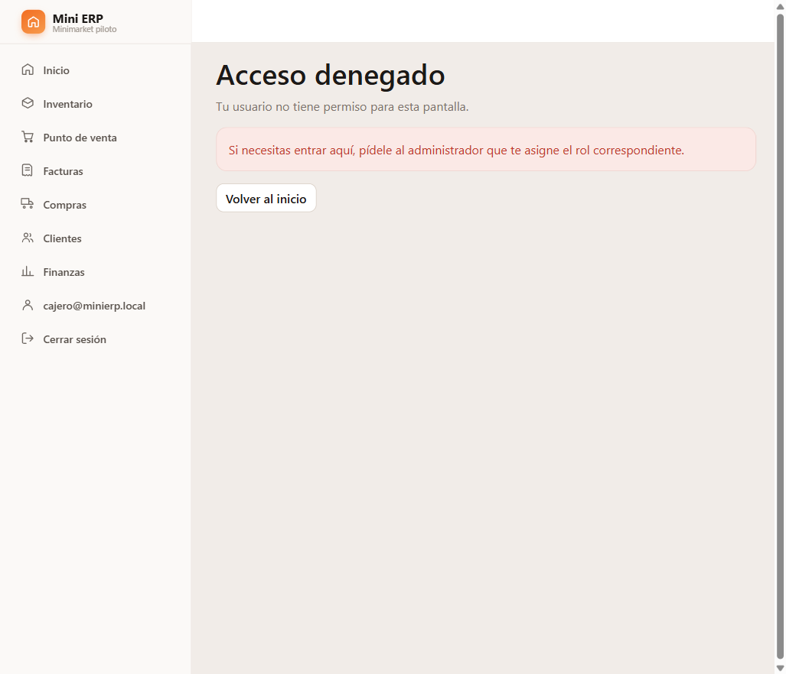
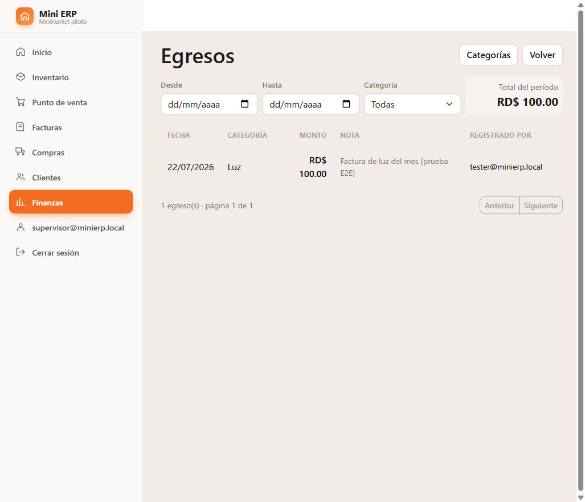
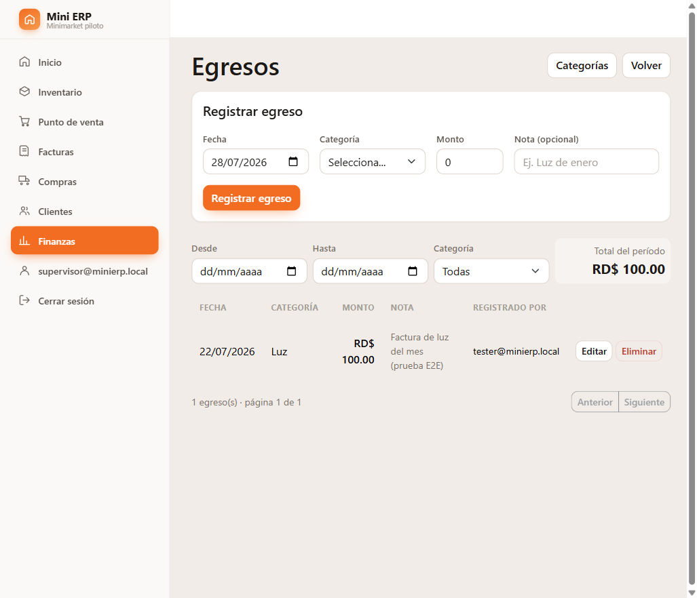

# 4.8 — Control de acceso: el módulo de Finanzas

Trabajo Final de Grado · Grupo 6 · Mini ERP · **Módulo de Finanzas (Samuel Sánchez Rosario)**

Esta es la parte de Finanzas de la sección 4.8. El núcleo del control de acceso —el catálogo
de permisos, las pantallas de administración de usuarios y la siembra de plantillas de rol—
corresponde a la rama `jeison/seguridad` y se documenta aparte. Aquí se explica **qué se
protege en Finanzas, con qué criterio y con qué evidencia.**

---

## 4.8.1 El problema que resuelve

Hasta este punto, todas las pantallas del sistema llevaban un único requisito de acceso:

```razor
@attribute [Authorize]
```

Eso significa una sola cosa: *"hay que haber iniciado sesión"*. No distingue quién eres.
En un minimarket con un dueño y dos empleados, esa distinción no es un lujo:

> El cajero entra al sistema a facturar. Con `[Authorize]` a secas, le basta con escribir
> `/finanzas` en la barra del navegador para ver **cuánto gana el negocio**, el margen de
> cada producto y cuánto efectivo hay en caja.

Ningún comerciante quiere eso. El margen es información sensible: con ella un empleado sabe
exactamente cuánto se le está ganando a cada artículo. Y el módulo de Finanzas es, por
definición, el que concentra toda esa información: es la capa que lee ventas, compras,
cobros y pagos para convertirlos en los números del negocio.

Por eso Finanzas es el módulo donde el control de acceso **más se nota**.

---

## 4.8.2 Los dos permisos de Finanzas, y por qué son dos

El catálogo define para este módulo exactamente dos permisos:

| Permiso | Qué habilita |
|---|---|
| `finanzas.ver` | Consultar: el panel y los cuatro reportes, y **leer** la lista de egresos y sus categorías |
| `finanzas.egreso` | Modificar: registrar, editar y eliminar egresos, y administrar sus categorías |

**No son dos por simetría, sino porque el rol Supervisor lo exige.** El propio `Roles.cs`
define ese rol como *«consulta de finanzas y reportes, sin capacidad de modificar»*. Si
hubiera un solo permiso `finanzas`, ese rol sería imposible de expresar: o el supervisor no
ve nada, o puede registrar gastos. Separar *ver* de *modificar* es lo que hace que la
intención declarada del rol se pueda cumplir de verdad.

Nótese que **no se creó un permiso por reporte**. Un `finanzas.rentabilidad` separado de un
`finanzas.flujo-caja` sería falsa precisión: los cuatro reportes muestran la misma clase de
información —lo que el negocio gana y el dinero que mueve—, y quien puede ver uno no gana
nada con que se le esconda otro. Se protege por *clase de información*, no por pantalla.

---

## 4.8.3 Qué se protegió, en dos niveles

El control se aplicó en **dos niveles distintos**, y hacen falta los dos.

### Nivel 1 — La ruta

Cada una de las siete pantallas del módulo declara el permiso que exige:

| Pantalla | Ruta | Permiso |
|---|---|---|
| Panel de Finanzas | `/finanzas` | `finanzas.ver` |
| Reporte de ingresos | `/finanzas/ingresos` | `finanzas.ver` |
| Reporte de rentabilidad | `/finanzas/rentabilidad` | `finanzas.ver` |
| Estado de resultados | `/finanzas/estado-resultados` | `finanzas.ver` |
| Flujo de caja | `/finanzas/flujo-caja` | `finanzas.ver` |
| Egresos | `/finanzas/egresos` | `finanzas.ver` |
| Categorías de egreso | `/finanzas/egresos/categorias` | `finanzas.ver` |

En código es una sola línea por pantalla:

```razor
@page "/finanzas/rentabilidad"
@attribute [Authorize(Policy = Permisos.FinanzasVer)]
```

**Por qué no basta con esconder el menú.** Ocultar el enlace de Finanzas en la barra lateral
mejora la experiencia, pero no protege nada: el empleado puede escribir la dirección a mano,
o llegar por un enlace guardado en favoritos. El menú es cortesía; **la ruta es la cerradura.**

### Nivel 2 — La acción

Dentro de las pantallas que sí se pueden consultar, las acciones que **modifican** se
esconden por separado:

```razor
<AuthorizeView Policy="@Permisos.FinanzasEgreso">
    ... formulario de registrar egreso ...
</AuthorizeView>
```

Se aplicó a:

- El **formulario completo** de registrar/editar egreso —no solo el botón—. Enseñarle a un
  supervisor unos campos que va a llenar y no va a poder enviar es prometerle algo que el
  sistema le negará; es peor que no mostrárselos.
- Los botones **Editar** y **Eliminar** de cada fila de la tabla de egresos.
- El formulario de **Agregar categoría** y los botones **Editar / Activar / Desactivar** del
  catálogo de categorías.

**Este segundo nivel es seguridad real, no cosmética.** El sistema está construido en Blazor
Server: el árbol de componentes se arma **en el servidor**, y solo se envía al navegador lo
que quedó dentro de él. Un botón escondido por `AuthorizeView` no existe en la página —no es
un botón oculto con CSS que se pueda revelar desde las herramientas del navegador—, y por
tanto **no tiene manejador de evento asociado al que un cliente malicioso pueda llamar.**

---

## 4.8.4 El Administrador siempre pasa

El manejador de autorización concede el permiso por dos vías, y el orden importa:

1. **El usuario tiene el rol Administrador** → pasa, tenga o no marcada la casilla.
2. **El usuario trae el permiso concedido** → pasa.

La primera regla es una decisión deliberada, no un descuido. El Administrador es **el dueño
del negocio**. Un sistema en el que el dueño puede quedarse fuera de su propia contabilidad
por haber olvidado marcar una casilla es un sistema que va a terminar desinstalado. La
alternativa —obligarlo a marcarse los 17 permisos a sí mismo— es una trampa esperando a que
alguien la pise.

---

## 4.8.5 Verificación

Se probó en el navegador, contra la aplicación corriendo y la base real, con tres usuarios.

### Escenario 1 — Empleado sin permisos de Finanzas

Usuario `cajero@minierp.local`, sin rol y sin ningún permiso concedido. Se probaron **las
siete rutas del módulo, escribiéndolas a mano** en la barra de direcciones:

```
BLOQUEADO  /finanzas
BLOQUEADO  /finanzas/ingresos
BLOQUEADO  /finanzas/rentabilidad
BLOQUEADO  /finanzas/estado-resultados
BLOQUEADO  /finanzas/flujo-caja
BLOQUEADO  /finanzas/egresos
BLOQUEADO  /finanzas/egresos/categorias
```

Las siete rebotan a la pantalla de acceso denegado. **Ninguna cifra del negocio llegó al
navegador.**



### Escenario 2 — Supervisor: consulta sin modificar

Usuario `supervisor@minierp.local`, con **únicamente** `finanzas.ver`. Entra a las siete
pantallas, pero en la de egresos:

- **Ve** la lista de egresos y el total del período (RD$ 100.00).
- **No ve** el formulario de registrar egreso: desapareció por completo.
- **No ve** los botones Editar ni Eliminar: la columna de acciones quedó vacía.

En el catálogo de categorías, el mismo comportamiento: ve las 5 categorías sembradas y
**cero botones** para tocarlas.



Esto es exactamente lo que `Roles.cs` promete del Supervisor, y ahora el sistema lo cumple.

### Escenario 3 — Con permiso para registrar

Al mismo usuario se le concedió además `finanzas.egreso`. Tras volver a iniciar sesión,
reaparecen el formulario de registro y los botones de acción.



### Escenario 4 — El bypass del Administrador

Al usuario del escenario 1 —que sigue con **cero permisos marcados**— se le asignó el rol
Administrador. Tras volver a entrar, accede a las siete rutas y ve el botón de registrar
egreso, **sin tener ni un solo permiso concedido**. La regla de bypass funciona.

### Comprobación de no regresión

Con el gateo puesto, los reportes siguen calculando igual: el estado de resultados y el flujo
de caja se recalcularon correctamente sobre los datos presentes, y la factura anulada
`B0200000004` **sigue quedando fuera** de ambos, como debe. Las **180 pruebas del dominio
siguen pasando**: el control de acceso no tocó ninguna regla de negocio, que es justamente lo
que se buscaba.

---

## 4.8.6 Un hallazgo: los permisos cambian al volver a entrar

Durante la verificación se observó un comportamiento que conviene dejar documentado, porque
va a generar dudas en el piloto:

> Se le concedió `finanzas.egreso` al supervisor y se recargó la pantalla **sin cerrar
> sesión**: el botón seguía sin aparecer. Solo apareció después de cerrar sesión y volver
> a entrar.

No es un error. ASP.NET Core Identity **copia los permisos del usuario dentro de la cookie de
sesión** en el momento de iniciar sesión; a partir de ahí, cada petición se resuelve leyendo
esa cookie, sin volver a consultar la base. Es una decisión de diseño del framework, y es la
razón por la que el sistema no hace una consulta a la base en cada clic.

La consecuencia práctica es concreta: **cuando el dueño le cambie los permisos a un empleado,
ese empleado tiene que volver a entrar para que le apliquen.** Se recomendó al responsable
del núcleo que la pantalla de administración de usuarios lo advierta en pantalla, o que
invalide la sesión del usuario afectado al guardar los cambios.

---

## 4.8.7 Lo que queda fuera de esta sección

Para no atribuirse trabajo ajeno, se deja explícito el límite:

- El **catálogo de permisos**, el mecanismo de políticas y su registro son del núcleo
  (`jeison/seguridad`).
- Las **pantallas de Usuarios y de Permisos del usuario** son del núcleo. Mientras no
  existan, los permisos se conceden directamente en la tabla de claims de Identity, que es
  lo que se hizo para verificar los escenarios de arriba.
- El **menú lateral** no se modificó: es un archivo compartido por los tres desarrolladores
  y su gateo corresponde al núcleo. Por eso, en las capturas, el enlace *Finanzas* sigue
  visible para el empleado sin permiso — **y al pulsarlo, rebota igual.** Esto ilustra bien
  por qué la protección tenía que ir en la ruta y no en el menú.
